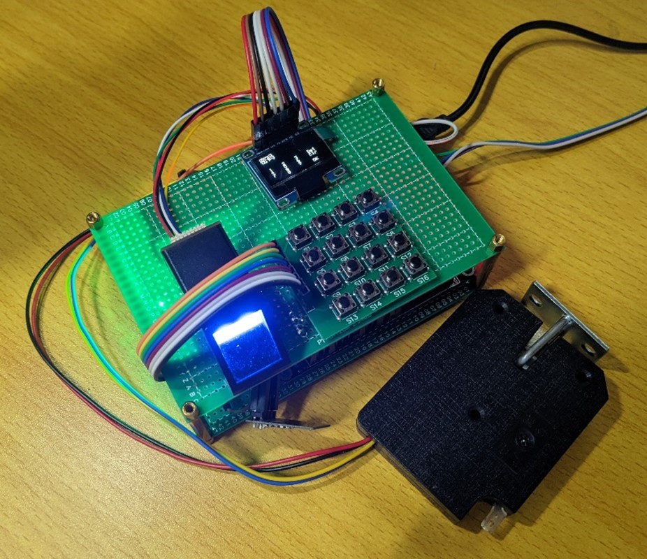
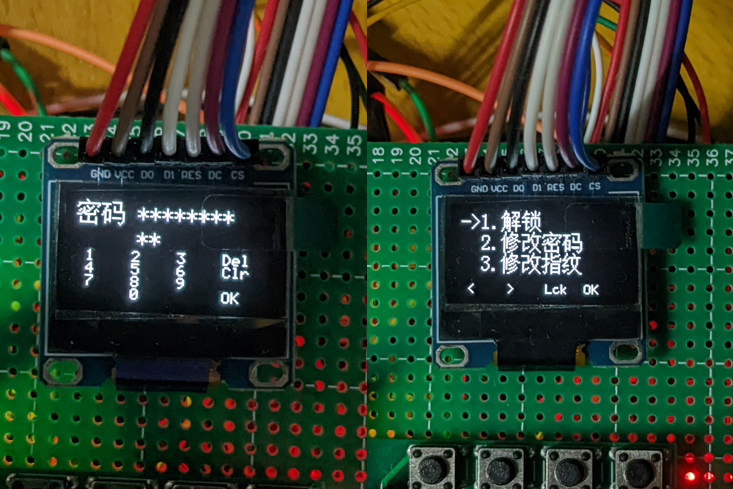
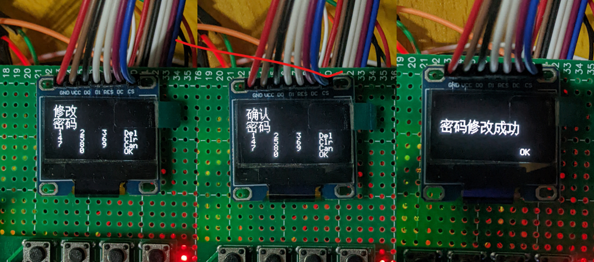
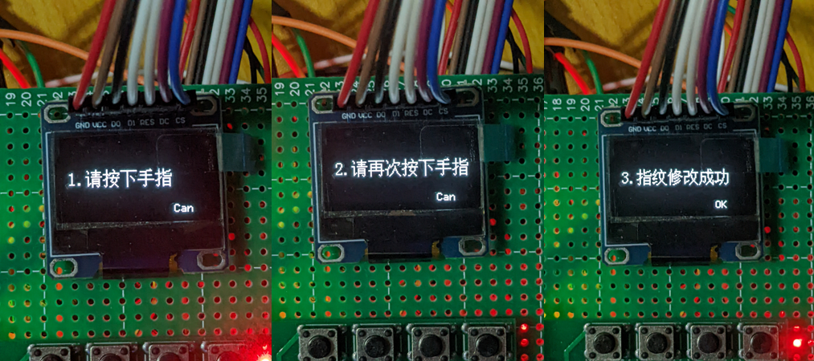

# STM32智能门锁_毕设

#### 介绍
一种智能门锁系统，该系统包括三个部分，门锁、云平台和安卓应用程序，门锁部分使用STM32作为主控芯片，通过Wi-Fi及MQTT协议接入云平台，与安卓应用程序联动，实现通过密码和指纹开锁及修改，还有虚位密码，超时锁定与事件通知等功能。

**仓库只包含硬件部分**。使用HAL库开发。

#### 功能
1. 单一密码（8~16位）与指纹解锁与修改，密码与指纹特征加密存储于外部Flash，没有密码时使用默认密码。
2. 解锁屏幕时支持虚位密码，即密码只需要包含在输入的数字串中即可解锁。
3. 解锁屏幕后超过一定时间不操作能够自动锁屏。
4. 较为友好的交互界面，在界面上显示按键提示；能够提示一些错误信息，例如密码错误、密码过短和两个指纹不一致等。
5. 通过Wi-Fi及MQTT协议接入阿里云平台，实现发送门锁状态、开门通知、修改钥匙通知、门未锁好通知，与接收请求发送钥匙ID的功能。
6. 一个关于屏幕的传统艺能。

#### 图片展示

#### 硬件模块
1. STM32F407VET6开发板
2. 0.96寸OLED显示模块
3. AS608指纹模块
4. 4x4矩阵键盘模块
5. ESP-01S无线模块(使用了[MQTT透传AT固件（固件号：1471）](https://docs.ai-thinker.com/%E5%9B%BA%E4%BB%B6%E6%B1%87%E6%80%BB))
6. 5V带反馈电控锁
7. 5V继电器
8. 其他：DapLink调试器

#### 开发工具
1. [STM32CubeMX](https://www.st.com/zh/development-tools/stm32cubemx.html)：工程初始化
2. [VSCode](https://code.visualstudio.com/)：代码编辑器
3. [LCD Image Convertor](https://lcd-image-converter.riuson.com/en/about/)：将图片或字符转化为字节数组

#### 编译环境
1. [STM32CubeF4 Firmware Package](https://www.st.com/zh/embedded-software/stm32cubef4.html) 1.27.0：固件包（可以于STM32CubeMX中下载），用于生成工程
2. [Arm GNU Toolchain](https://developer.arm.com/downloads/-/gnu-rm) 10.3-2021.10：编译工具链

#### 调试环境
1. [Cortex-Debug](https://github.com/Marus/cortex-debug)：在VSCode中调试Cortex-M单片机
2. [OpenOCD](https://openocd.org/)：使用了[Cortex-Debug开发者fork的版本](https://github.com/haneefdm/openocd)以正常使用RTT调试
3. [J-Link Software and Documentation Pack](https://www.segger.com/downloads/jlink)：获取RTT调试源文件
4. [System View Description](https://www.st.com/zh/microcontrollers-microprocessors/stm32-32-bit-arm-cortex-mcus.html#cad-resources)：需要该文件以在调试时查看各个外设寄存器的值
